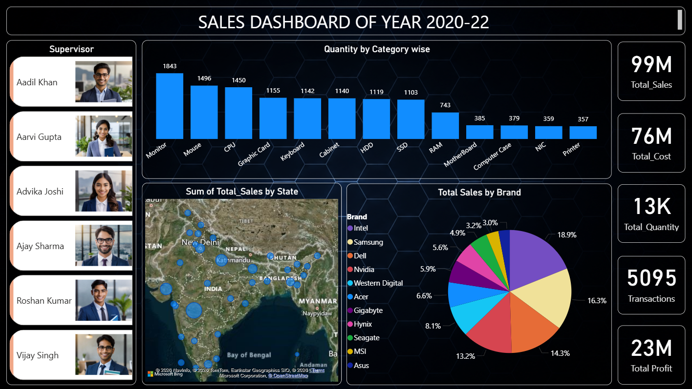

# Sales Dashboard 2020-22 — Power BI

## Dashboard Preview

## Overview
An interactive Power BI dashboard analyzing sales performance
of a computer hardware and electronics business for years 2020-22.

## Key Metrics
- Total Sales: 99M
- Total Cost: 76M
- Total Quantity: 13K
- Total Transactions: 5095
- Total Profit: 23M

## Visuals Included
- Quantity by Category (Bar Chart)
- Sum of Total Sales by State (Map Visual)
- Total Sales by Brand (Pie Chart)
- Supervisor Performance Panel
- KPI Cards (Sales, Cost, Quantity, Transactions, Profit)

## Tools Used
- Microsoft Power BI Desktop
- DAX Measures
- Map Visual (Bing Maps)
- Data Visualization
